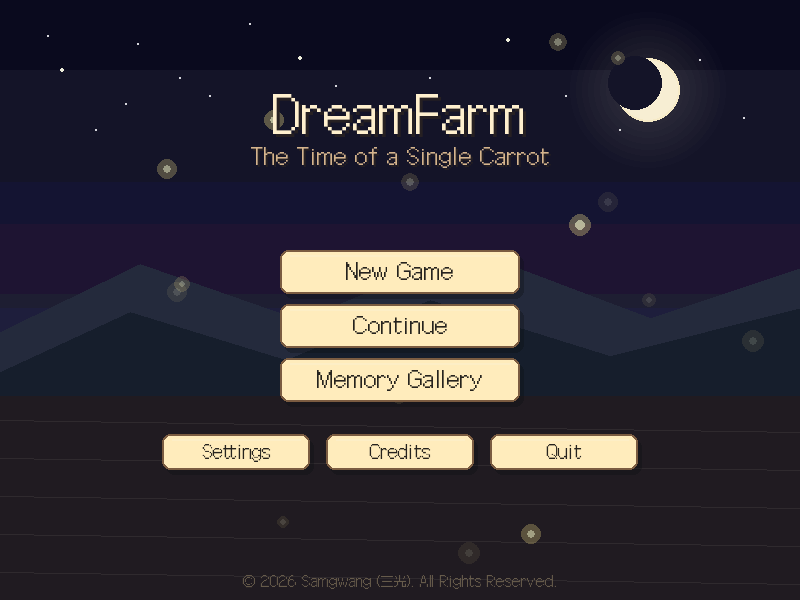
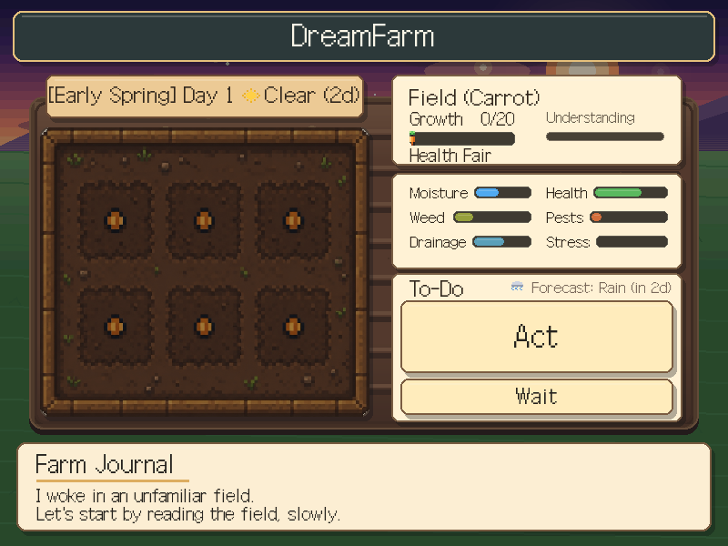
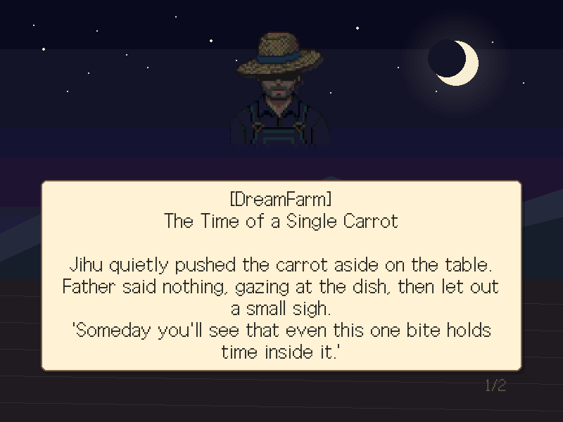
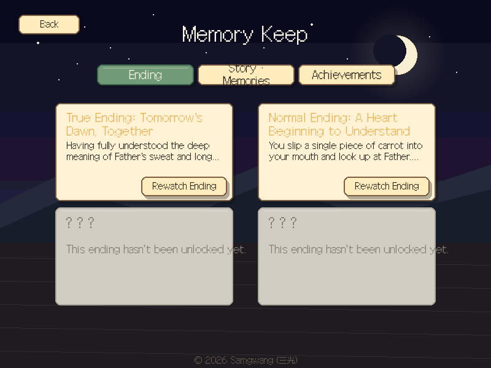
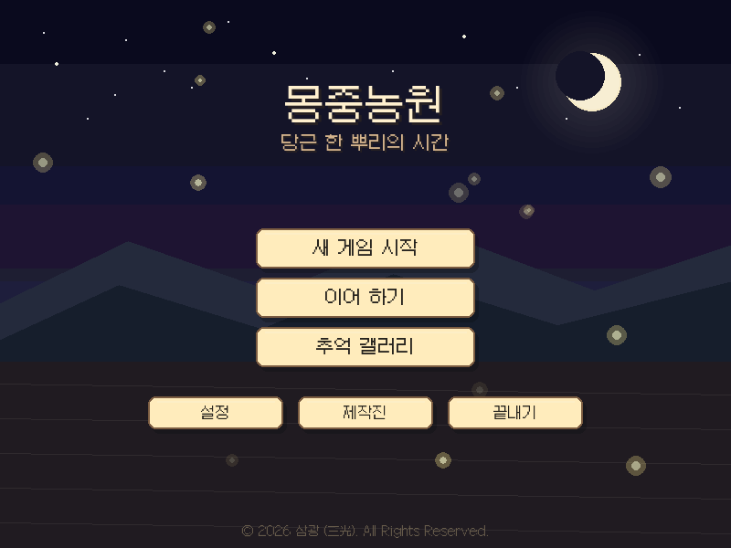

# 몽중농원 🥕 (DreamFarm)

<p align="center">
  
  
  
  
  
  
</p>

> *밀어낸 당근 한 조각에는, 누군가의 새벽이 들어 있었다.*
>
> *In that one carrot you pushed aside, someone's dawn was folded in.*

식탁 위 반찬을 말없이 밀어낸 아이가, 그날 밤 꿈속의 밭에서 눈을 뜬다.
**"네가 밀어낸 것을, 이번에는 네 손으로 길러 보아라."**
한 작물을 길러내는 과정을 통해 아버지의 노동과 사랑을 이해해 가는,
Pygame으로 만든 **감성 내러티브 픽셀 농장 게임**입니다. **한국어·영어**를 지원합니다.

<p align="center">
  
  &nbsp;
  
</p>

---

## 다운로드 (Download)

[**Releases**](../../releases) 페이지에서 내려받습니다.

| 플랫폼 | 파일 | 실행 |
|---|---|---|
| **Windows** | `DreamFarm.exe` | 더블클릭 (설치 불필요, 단일 파일) |
| **Android** | `...-debug.apk` | 사이드로드(“출처를 알 수 없는 앱” 허용) |
| **Android (Play)** | `...-release.aab` | 플레이 콘솔 업로드용 번들 |

- **Latest**로 표시된 릴리스가 정식 버전, `-dev`가 붙은 릴리스는 **테스터용 프리릴리스**입니다.
- 저장 파일은 사용자 환경에 맞는 안전한 위치(`%APPDATA%` / 앱 전용 저장소)에 생성됩니다.

## 직접 실행 (개발)

```bash
pip install -r requirements.txt
python main.py
```

- Python 3.10+ / pygame-ce / numpy
- 픽셀 폰트(**Galmuri11**)는 저장소에 포함(없으면 자동 다운로드), 오디오 장치가 없으면 자동 무음.
- 언어는 게임 내 **설정 → 언어**에서 한국어/English 전환(설정은 저장됩니다).

## 스크린샷 (Screenshots)

| 인트로 | 추억 갤러리 | 타이틀 (한국어) |
|---|---|---|
|  |  |  |

## 조작법 (Controls)

| 입력 | 동작 |
|------|------|
| 마우스 클릭/드래그 | 행동 선택, 손맛 조작(물주기·잡초·수확 등), 대화 진행 |
| 스페이스바 | 텍스트 진행 / 넘기기 (엔딩 크레딧은 꾹 눌러 게이지로 넘김) |
| **ESC** | 설정 열기 (메뉴 화면에서는 뒤로가기) |
| **M** | 음소거 토글 |
| **F11** | 전체 화면 토글 (설정창에서도 가능) |
| **R** | (엔딩 화면) 다시하기 |

## 핵심 특징 (Features)

- **읽고 판단하는 밭 관리** — 정답을 알려주지 않습니다. 수분·건강·잡초·해충·배수·스트레스
  여섯 스탯과 밭의 '증상'을 읽고 스스로 판단합니다.
- **기다림의 게임** — 작물은 제대로 된 돌봄과, 밭이 평온할 때의 '기다리기'에서만 자랍니다.
- **태도로 갈리는 엔딩** — 점수가 아니라 인내·공감·이해가 결말(진·노멀·배드·시듦)을 정하고,
  결과 화면이 '왜 이 엔딩인지'를 알려줍니다.
- **여러 작물** — 엔딩을 한 번 보면 사과나무·감자·벼가 열립니다. 작물마다 밭의 성질·그래픽·
  미니게임·수확 방식이 다릅니다.
- **업적 · 갤러리** — 잠금 해제식 업적과 엔딩·사건·회상 갤러리.
- **악)몽중농원** — 진엔딩을 보면 열리는 지옥 모드(검붉은 밭 테마).
- **한/영 현지화** — 렌더 계층 자동 번역으로 UI·서사까지 전환. [Crowdin](https://crowdin.com) 연동 준비.
- **절차적 사운드** — 효과음·배경음을 numpy로 합성(외부 음원 0개), 배포 빌드는 미리 구운 OGG 사용.

## 코드 구조 (Structure)

```
main.py / game_main.py   게임 루프 · 씬 전환 · 스케일링 · 오버레이/ESC 라우팅
core/
  game_state.py   전역 상태 · 엔딩 판정 · 이벤트 · 서사 데이터
  i18n.py / i18n_data.py / locales/   현지화 엔진 · 카탈로그 · Crowdin JSON
  palette.py      공용 색 팔레트(디자인 소스)
  assets.py       픽셀 스프라이트 · 폰트 · 작물/아이콘 그래픽 · 배경
  audio.py        절차적 오디오(런타임 합성 / 구운 OGG)
  save_system.py · achievements.py · settings_overlay.py · ui.py · steam.py · version.py
scenes/           title · intro · crop_select · farm · stage1~4 · tending · story_choice ·
                  memory · epiphany · star_connect · father_day · gallery · ending · transition
```

## 문서 (Docs)

| 문서 | 내용 |
|---|---|
| [`HANDOFF.md`](HANDOFF.md) | **인수인계 가이드** — 구조·한 일·할 일·노하우 (작업 시작 전 필독) |
| [`CHANGELOG.md`](CHANGELOG.md) | 버전별 변경 내역 |
| [`LOCALIZATION.md`](LOCALIZATION.md) | 현지화 시스템 · Crowdin 워크플로 · 문구 추가법 |
| [`STEAM.md`](STEAM.md) | 스팀 출시 준비 상태 · 로드맵 |
| [`DESIGN_AUDIT.md`](DESIGN_AUDIT.md) | UI/디자인 일관성 감사 · P1~P4 로드맵 |
| [`RELEASING.md`](RELEASING.md) | 안드로이드 정식 출시(서명 AAB) 가이드 |

배포는 **git 태그 push**로 자동화됩니다(`.github/workflows/release.yml`). `-dev` 태그 = 프리릴리스,
그 외 `vX.Y.Z` = 정식(Latest). 브랜치는 `dev`(개발) → `main`(안정). 로드맵은 [#7](../../issues/7).

---

## 저작권 (Copyright)

© 2026 삼광 (三光). All Rights Reserved.

이 게임의 소스 코드와 리소스(그래픽·사운드 등)는 **삼광(三光)** 팀의 자산이며 저작권법의 보호를
받습니다. 무단 복제·배포·상업적 이용을 금합니다. 자세한 내용은 [`LICENSE`](LICENSE)를 참고하세요.

사용 폰트 **갈무리11(Galmuri11)** — © 2019–2025 Lee Minseo, [SIL Open Font License 1.1](LICENSE).
